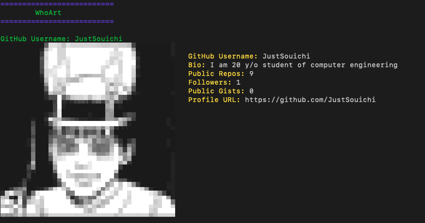

<h3 align="center"></h3>
<p align="center">A simple CLI tool to display your GitHub profile as an ASCII art image.</p>


<p align="center">
<a href="./LICENSE"></a>
<a href="https://img.shields.io/github/stars/JustSouichi/WhoArt?style=social"></img></a>
<a href="https://github.com/JustSouichi/WhoArt/releases"></a>
<a href="https://repology.org/metapackage/whoart"></a>
</p>

# WhoArt

WhoArt is a simple CLI tool that displays your GitHub profile as an ASCII art image, alongside key profile information such as your username, bio, public repositories, followers, and more.

**Why is WhoArt useful?**  
When configuring your Git credentials with `git config`, it can often be unclear who exactly you are setting up, especially when there are multiple accounts or complex configurations. This can lead to confusion and mistakes. **WhoArt** helps solve this problem by showing exactly **who you are** in a simple, clear way, by displaying your GitHub profile as an ASCII image and including all your important details. Now, you won’t have to wonder who you are when working with Git.

**Warning:**
- **Works best in default terminals** such as **macOS Terminal** (xterm - 256 color) and other similar terminal environments.
- ASCII art rendering and colors may not appear correctly in terminals with limited color support.

  <!-- Replace with the correct image path -->

## Install

To install the package globally, run the following command:

```bash
npm install -g whoart
```

## Usage

After installation, you can run the following command in your terminal:

```bash
whoart
```

This will display your GitHub profile image as ASCII art, with the following information:

- GitHub Username
- Bio
- Public Repositories
- Followers
- Public Gists
- Profile URL

Example Output:

```
==========================
        WhoArt
==========================

GitHub Username: JustSouichi
GitHub Username:  JustSouichi
Bio: I am 20 y/o student of computer engineering
Public Repos: 9
Followers: 1
Public Gists: 0
Profile URL: https://github.com/JustSouichi
```

## License

MIT License. See the [LICENSE](./LICENSE) file for more details.